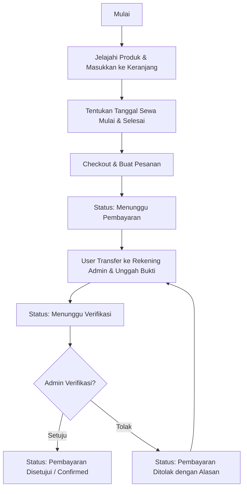

# Product Requirement Document (PRD) - Web Sewa Alat Pendakian

Dokumen ini menjelaskan persyaratan produk, arsitektur, skema basis data, dan alur kerja untuk pengembangan aplikasi Web Sewa Alat Pendakian menggunakan **TypeScript**, **Next.js**, dan **Supabase**.

---

## 1. Ringkasan Proyek (Project Overview)

Aplikasi ini adalah platform e-commerce penyewaan alat pendakian gunung. Fitur utama aplikasi ini adalah sistem pembayaran transfer bank manual, di mana pengguna mengunggah bukti transfer, dan admin memverifikasi bukti tersebut secara manual untuk menyetujui atau menolak pesanan.

### Tech Stack Utama:
- **Frontend**: Next.js (React / TypeScript / Tailwind CSS / shadcn/ui)
- **Backend & Database**: Supabase (PostgreSQL, Supabase Auth, Supabase Storage, Row Level Security / RLS)
- **State Management / Data Fetching**: React Query (TanStack Query) atau SWR, serta Supabase Client

---

## 2. Peran Pengguna (User Roles)

Aplikasi ini memiliki dua peran utama:

1. **Pelanggan (Customer / User)**:
   - Mendaftar dan masuk ke akun.
   - Menjelajah katalog alat pendakian (filter berdasarkan kategori, pencarian).
   - Memilih alat, kuantitas, dan tanggal sewa (mulai & selesai).
   - Menambahkan item ke keranjang belanja (Cart).
   - Melakukan checkout dengan memilih metode transfer bank dan melihat detail rekening admin serta total nominal.
   - Mengunggah bukti transfer (foto/screenshot struk transfer).
   - Melihat riwayat sewa dan status pesanan saat ini (Menunggu Pembayaran, Menunggu Verifikasi, Diterima, Sedang Disewa, Selesai, Ditolak).

2. **Admin**:
   - Masuk ke dashboard admin khusus.
   - Mengelola katalog produk (CRUD alat pendakian, stok, kategori, dan harga sewa per hari).
   - Melihat semua pesanan sewa yang masuk dengan berbagai status.
   - Memverifikasi pembayaran manual: melihat detail pesanan, melihat gambar bukti transfer, lalu memilih **Setujui (Approve)** atau **Tolak (Reject)** dengan alasan penolakan.
   - Mengubah status sewa setelah pembayaran disetujui (misal: "Siap Diambil", "Sedang Disewa", "Telah Dikembalikan", atau "Terlambat").

---

## 3. Alur Kerja Utama (Core Workflows)

### A. Alur Pemesanan & Pembayaran (User Side)


1. **Penyewaan**: User memilih alat dan durasi sewa (misal 3 hari). Total harga dihitung berdasarkan rumus: 
   $$\text{Total} = \sum (\text{Harga per Hari} \times \text{Kuantitas}) \times \text{Jumlah Hari Sewa}$$
2. **Checkout**: Pesanan dibuat dengan status `PENDING_PAYMENT`. Sistem menampilkan detail rekening bank tujuan transfer.
3. **Upload Bukti**: User mengunggah file bukti transfer melalui halaman detail transaksi. Setelah diunggah, status pesanan berubah menjadi `PENDING_VERIFICATION`.
4. **Verifikasi Admin**: Admin memeriksa bukti.
   - Jika valid, status berubah menjadi `CONFIRMED`.
   - Jika tidak valid, status berubah menjadi `REJECTED`, dan admin memasukkan alasan (misal: "Nominal tidak sesuai", "Bukti buram"). User bisa mengunggah ulang bukti pembayaran baru.

### B. Alur Pengembalian Alat (Admin Side)
Setelah pesanan berstatus `CONFIRMED`:
1. Pengguna mengambil alat (atau dikirim) $\rightarrow$ Admin mengubah status menjadi `RENTED` (Sedang Disewa).
2. Masa sewa berakhir $\rightarrow$ Pengguna mengembalikan alat.
3. Admin memeriksa kondisi alat $\rightarrow$ Admin mengubah status menjadi `RETURNED` (Selesai).
4. Jika terlambat mengembalikan $\rightarrow$ Admin bisa mengubah status menjadi `LATE` (Terlambat) dan mengenakan denda jika ada.

---

## 4. Skema Database (Supabase / PostgreSQL)

Berikut adalah struktur tabel yang diusulkan di database Supabase:

### 1. Tabel `profiles` (Menyimpan informasi tambahan user)
Menghubungkan ke tabel bawaan Supabase `auth.users`.
```sql
create table public.profiles (
  id uuid references auth.users on delete cascade primary key,
  full_name text not null,
  phone text,
  address text,
  role text check (role in ('admin', 'customer')) default 'customer',
  created_at timestamp with time zone default timezone('utc'::text, now()) not null
);
```

### 2. Tabel `categories`
```sql
create table public.categories (
  id bigint generated by default as identity primary key,
  name text not null,
  slug text not null unique,
  created_at timestamp with time zone default timezone('utc'::text, now()) not null
);
```

### 3. Tabel `products`
```sql
create table public.products (
  id uuid default gen_random_uuid() primary key,
  name text not null,
  description text,
  price_per_day decimal(12, 2) not null,
  stock integer not null default 0,
  image_url text, -- Disimpan di Supabase Storage
  category_id bigint references public.categories on delete set null,
  created_at timestamp with time zone default timezone('utc'::text, now()) not null
);
```

### 4. Tabel `rentals` (Header Transaksi)
```sql
create type rental_status as enum (
  'pending_payment',      -- Menunggu transfer dari user
  'pending_verification', -- User sudah upload bukti, menunggu verifikasi admin
  'confirmed',            -- Pembayaran disetujui, siap diambil/dikirim
  'rented',               -- Alat sedang dibawa oleh user
  'returned',             -- Alat sudah kembali dengan aman
  'late',                 -- Terlambat mengembalikan
  'cancelled'             -- Pesanan dibatalkan
);

create table public.rentals (
  id uuid default gen_random_uuid() primary key,
  user_id uuid references public.profiles(id) on delete cascade not null,
  start_date date not null,
  end_date date not null,
  total_price decimal(12, 2) not null,
  status rental_status default 'pending_payment' not null,
  payment_proof_url text, -- Link bukti transfer di Supabase Storage
  bank_name_destination text, -- Rekening bank tujuan (misal: BCA, Mandiri)
  sender_name text, -- Nama pengirim dari struk transfer yang diinput user
  rejection_reason text, -- Alasan jika verifikasi ditolak
  created_at timestamp with time zone default timezone('utc'::text, now()) not null,
  updated_at timestamp with time zone default timezone('utc'::text, now()) not null
);
```

### 5. Tabel `rental_items` (Detail Transaksi)
```sql
create table public.rental_items (
  id uuid default gen_random_uuid() primary key,
  rental_id uuid references public.rentals(id) on delete cascade not null,
  product_id uuid references public.products(id) on delete restrict not null,
  quantity integer not null check (quantity > 0),
  price_per_unit decimal(12, 2) not null -- Menyimpan harga saat booking dibuat
);
```

### 6. Tabel `bank_accounts` (Rekening Pembayaran Admin)
```sql
create table public.bank_accounts (
  id bigint generated by default as identity primary key,
  bank_name text not null,
  account_number text not null,
  account_holder text not null,
  is_active boolean default true not null
);
```

---

## 5. Supabase Storage Buckets

Dua bucket penyimpanan pribadi/publik diperlukan:
1. **`product-images`** (Public Access): Menyimpan gambar produk katalog alat pendakian.
2. **`payment-proofs`** (Private/Restricted Access): Menyimpan bukti transfer pembayaran. Hanya admin yang dapat melihat semua bukti, dan pelanggan hanya dapat melihat bukti miliknya sendiri (dijaga melalui RLS atau signed URL).

---

## 6. Persyaratan Fungsional Halaman (Screen Requirements)

### Sisi Pelanggan (Customer View)
1. **Landing Page & Catalog**: Menampilkan daftar alat outdoor dengan grid modern, filter kategori, bar pencarian, serta badge status ketersediaan (In Stock / Out of Stock).
2. **Detail Produk**: Menampilkan deskripsi lengkap produk, harga sewa per hari, jumlah stok tersisa, dan tombol "Tambah ke Keranjang".
3. **Cart & Booking Page**: 
   - Menampilkan list barang yang dipilih.
   - Form input Tanggal Mulai dan Tanggal Selesai (dengan Date Range Picker terintegrasi untuk kalkulasi hari otomatis).
   - Validasi stok sebelum checkout.
4. **Checkout / Payment Page**:
   - Menampilkan detail pesanan & ringkasan harga sewa.
   - Menampilkan daftar rekening bank admin (`bank_accounts`) untuk tujuan transfer.
   - Form input Nama Pengirim Bank, Bank Asal, dan input File Bukti Transfer (gambar/struk).
   - Tombol "Kirim Bukti Pembayaran".
5. **Customer Dashboard / Order History**:
   - Menampilkan daftar transaksi yang pernah dan sedang disewa.
   - Menampilkan status saat ini secara real-time.
   - Menampilkan alasan penolakan jika status ditolak, serta tombol untuk mengunggah ulang bukti.

### Sisi Admin (Admin Dashboard)
1. **Overview Dashboard**: Ringkasan statistik (total transaksi, jumlah pesanan pending verification, grafik penyewaan terpopuler).
2. **Product Management (CRUD)**:
   - Form tambah, edit, dan hapus produk pendakian.
   - Fitur upload foto produk ke Supabase Storage.
   - Pengaturan stok real-time.
3. **Rental Order Management**:
   - Filter pesanan berdasarkan status (terutama status `pending_verification`).
   - Detail Pesanan Modal: Menampilkan data pemesan, item yang disewa, tanggal sewa, detail pengiriman, dan **gambar bukti transfer dengan fitur zoom-in**.
   - Tombol Aksi: **Approve Payment** (mengubah status ke `confirmed`) & **Reject Payment** (membuka dialog input alasan penolakan).
4. **Rental Lifecycle Update Page**:
   - Mengubah status pesanan dari `confirmed` $\rightarrow$ `rented` saat serah terima alat.
   - Mengubah status dari `rented` $\rightarrow$ `returned` setelah pengembalian alat, dengan verifikasi kondisi alat.

---

## 7. Desain & Estetika (UI/UX)

Sesuai standar antarmuka premium:
- **Tema**: Default Dark/Light Mode dengan transisi halus. Nuansa warna alam/outdoor premium (e.g., Forest Green, Charcoal Black, Warm Sand / Earth tones).
- **Komponen**: Menggunakan pustaka komponen modern **shadcn/ui** yang dimodifikasi.
- **Tipografi**: Menggunakan Google Font modern seperti *Inter* atau *Outfit*.
- **Animasi**: Framer Motion untuk transisi halaman dan mikro-animasi pada hover kartu produk, tombol, dan pembukaan dialog modal.
- **Responsif**: Desain harus 100% responsif dan ramah seluler (Mobile-First) karena mayoritas pendaki menyewa menggunakan ponsel pintar.

---

## 8. Langkah Implementasi Selanjutnya (Next Steps)

1. **Inisialisasi Project**:
   Setup Next.js dengan TypeScript dan Tailwind CSS di workspace.
2. **Supabase Setup**:
   Membuat database instansi di Supabase, menjalankan skrip DDL SQL di atas, mengaktifkan RLS, serta membuat bucket storage.
3. **Auth Setup**:
   Implementasi Supabase Auth middleware untuk proteksi rute admin (`/admin/*`) dan customer (`/dashboard/*`).
4. **Membangun Layout & UI**:
   Implementasi halaman Landing, Katalog, Keranjang, Checkout, dan Admin Dashboard.
5. **Integrasi Supabase & State Management**:
   Sinkronisasi data keranjang belanja, proses checkout, upload file bukti transfer, dan fungsi verifikasi admin.
